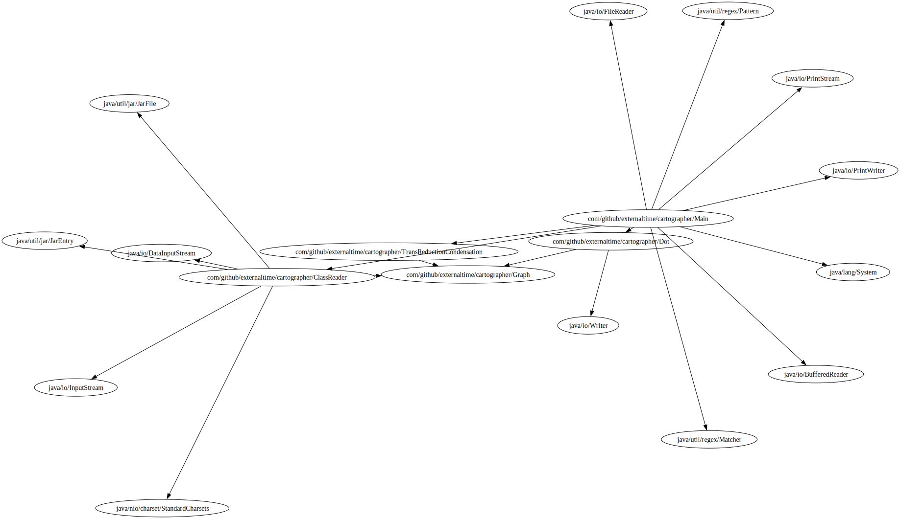
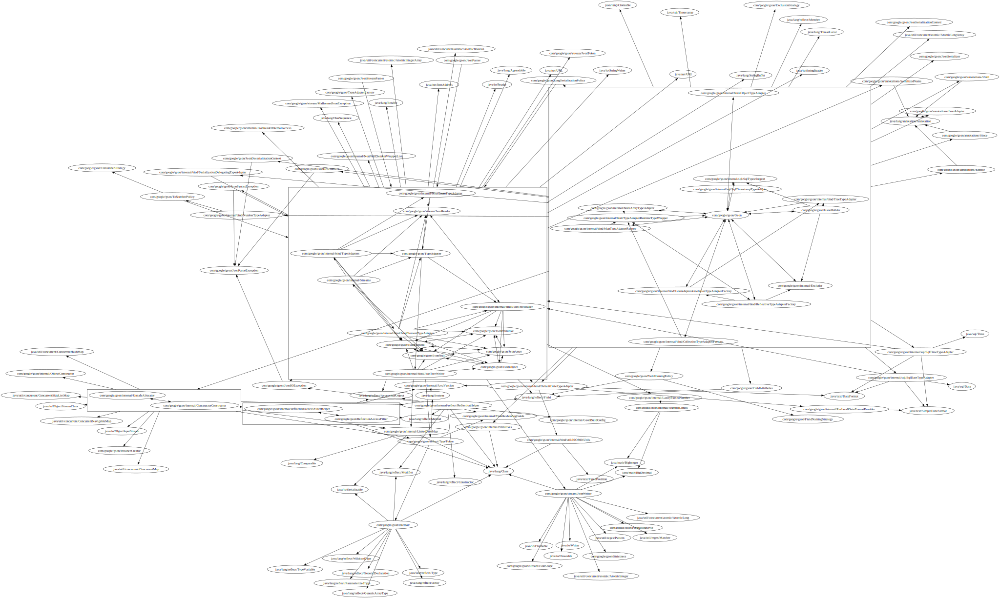

# Cartographer

Java codebase visualization tool. Generates a graph showing dependencies between
modules. Groups mutually dependent modules into groups and removes edges that
don't carry any new information for readability (transitive reduction).

By `A` depending on `B` I mean that either `A` uses `B` in its definition
directly or that there is some other module that `A` depends on and that uses
`B`.

## Examples

Graph of this project:



Gson:



Other graphs can be found in `example_graphs` folder.

## Usage

First we need graphviz or some way to use its `fdp` layout engine. Once we have
it installed we can run:

```sh
mvn package
java -jar target/cartographer-[current-version].jar filters.txt [path to jar you want to graph] | fdp -Tsvg > output_file.svg
```

If you want to use this program with other layout engine, you will likely
need to modify it a bit. Out of default layouts only fdp allows for defining
connection from and to clusters.

## Conclusions and future of this project

As you can probably see the results are kinda bad. Could try to make some small
improvements by expermineting with grouping stuff into more clusters or by
filtering out anything that gets defined be dependencies, but that won't really
solve the core issue here.

The layout egnines in graphviz are simply not enough. Ideally we'd use something
like force-directed graph for clusters of mutually recursive modules and
hierarchical layout for the bigger structure (which *does* form a DAG), but
I don't think graphviz supports that (and the `dot` layout seems to be kinda
bad anyway for anything bigger). I could try laying out the graph myself and
directly generating an `.svg`, but this was meant to be a small project and
that'd require *a lot* more work on my part than I anticipated or am willing to
spend time on right now.

Ultimately I'll leave this project as is. Might make some small tweaks to it if
I feel like it, but I don't expect it to ever actually become significant help.
